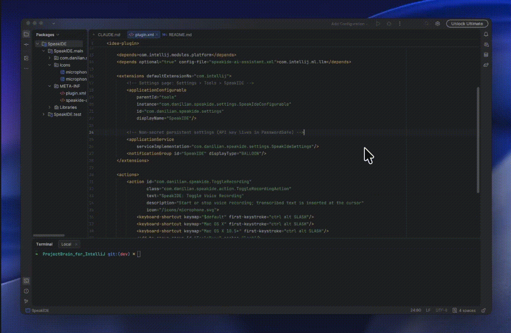

# SpeakIDE

**Voice dictation for IntelliJ IDEA** — press a shortcut, speak, and your words appear wherever the cursor is: code editor, AI Chat, Junie, commit message, any text field.

---

## Demo




---

## Features

- **Universal input** — works in any text field: code editor, AI Chat / Junie, commit message, search boxes
- **Two STT backends** — switch between cloud and offline in settings:
  - **OpenAI Whisper** (cloud) — high accuracy, supports any OpenAI-compatible endpoint (OpenAI, Groq, etc.)
  - **Vosk** (offline) — fully local, no internet required, no data leaves your machine
- **Auto-stop on silence** — recording ends automatically after a configurable pause; no need to press the shortcut again
- **Clipboard fallback** — if no editor is focused when recording stops, the transcribed text is copied to clipboard
- **Microphone button in AI Chat toolbar** — one-click dictation directly from the AI Assistant / Junie input bar
- **Configurable language** — set a language hint or leave on `auto` for automatic detection
- **Secure key storage** — API key stored in IntelliJ's `PasswordSafe`, never in plain text on disk

---

## Installation

> *(Plugin not yet published to the Marketplace — build from source below)*

### From source

**Requirements:** JDK 21, IntelliJ IDEA 2024.2+

```bash
git clone https://github.com/Dragonav4/SpeakIDE.git
cd SpeakIDE
./gradlew runIde          # launch a sandbox IDE with the plugin
./gradlew buildPlugin     # build distributable .zip → build/distributions/
```

Install the `.zip` via **Settings → Plugins → ⚙ → Install Plugin from Disk**.

---

## Setup

### OpenAI Whisper (cloud)

1. Open **Settings → Tools → SpeakIDE**
2. Select **Provider → OpenAI Whisper (Cloud)**
3. Paste your API key (stored securely)
4. Set **Base URL** and **Model Name**:

| Provider | Base URL | Model |
|----------|----------|-------|
| OpenAI | `https://api.openai.com/v1` | `whisper-1` |
| Groq | `https://api.groq.com/openai/v1` | `whisper-large-v3-turbo` |

### Vosk (offline)

1. Download a model from [alphacephei.com/vosk/models](https://alphacephei.com/vosk/models)  
   Recommended: `vosk-model-small-en-us` (~50 MB) or `vosk-model-small-ru`
2. Extract the archive
3. Open **Settings → Tools → SpeakIDE**
4. Select **Provider → Vosk (Offline)**
5. Set **Vosk model path** to the extracted folder

---

## Usage

| Action | How |
|--------|-----|
| Start / stop recording | `Ctrl+Alt+/` (all platforms) |
| Start / stop from AI Chat | Click the 🎤 button in the AI Chat input toolbar |
| Auto-stop | Speak, then pause — recording stops after silence timeout |
| No editor focused | Transcribed text is copied to clipboard automatically |

The microphone icon in the toolbar turns **red** while recording is active.

---

## Settings Reference

**Settings → Tools → SpeakIDE**

| Setting | Description |
|---------|-------------|
| Provider | `OpenAI Whisper (Cloud)` or `Vosk (Offline)` |
| Language | Language hint (`auto`, `en`, `ru`, `de`, …) |
| API Key | Whisper API key — stored in PasswordSafe |
| Base URL | Whisper-compatible endpoint URL |
| Model Name | Model identifier for the API |
| Vosk model path | Path to the extracted Vosk model folder |
| Enable silence detection | Auto-stop recording after a pause |
| Silence threshold (ms) | How long the pause must be before stopping (default 2000 ms) |
| Show recording overlay | Visual indicator while recording |

---

## Architecture

```
ToggleRecordingAction  (~30 lines, delegates only)
        │
        ▼
RecordingService  (@Service APP — owns the state machine)
        │
        ├── RecordingState (sealed class: Idle / Recording / Transcribing)
        │
        ├── AudioSource (interface)
        │       └── AudioCapture (TarsosDSP)
        │               ├── MicPermissionProbe
        │               └── SilenceTimeoutProcessor
        │
        ├── PcmBuffer  (ConcurrentLinkedQueue — thread-safe PCM accumulator)
        │
        ├── SttProviderFactory
        │       ├── OpenAiWhisperProvider  ── shared HttpClient (lazy) ── Whisper API
        │       └── VoskProvider  ── Vosk JNI (native arm64 / x86_64)
        │
        ├── TextDelivery (fun interface)
        │       ├── CaretTextDelivery   (WriteCommandAction on EDT)
        │       └── ClipboardTextDelivery  (fallback when no editor focused)
        │
        ├── RecordingIndicator (interface)
        │       └── RecordingOverlay  (floating Swing window)
        │
        └── SpeakIdeNotifier  (wraps NotificationGroupManager)
```

The AI Chat microphone button is a second registration of `ToggleRecordingAction` added to the AI Assistant toolbar — loaded only when the `com.intellij.ml.llm` plugin is present (optional dependency).

---

## Contributing

Pull requests are welcome. For major changes, open an issue first.

```bash
./gradlew test            # run unit tests
./gradlew runIde          # test in sandbox IDE
```

---

## License

[APACHE 2.0](LICENSE)
